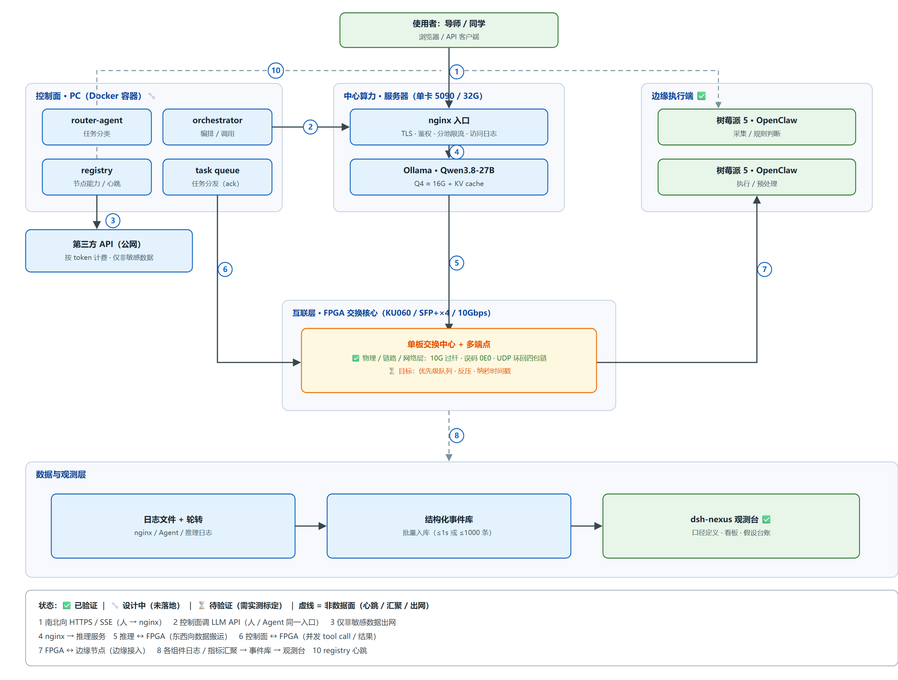
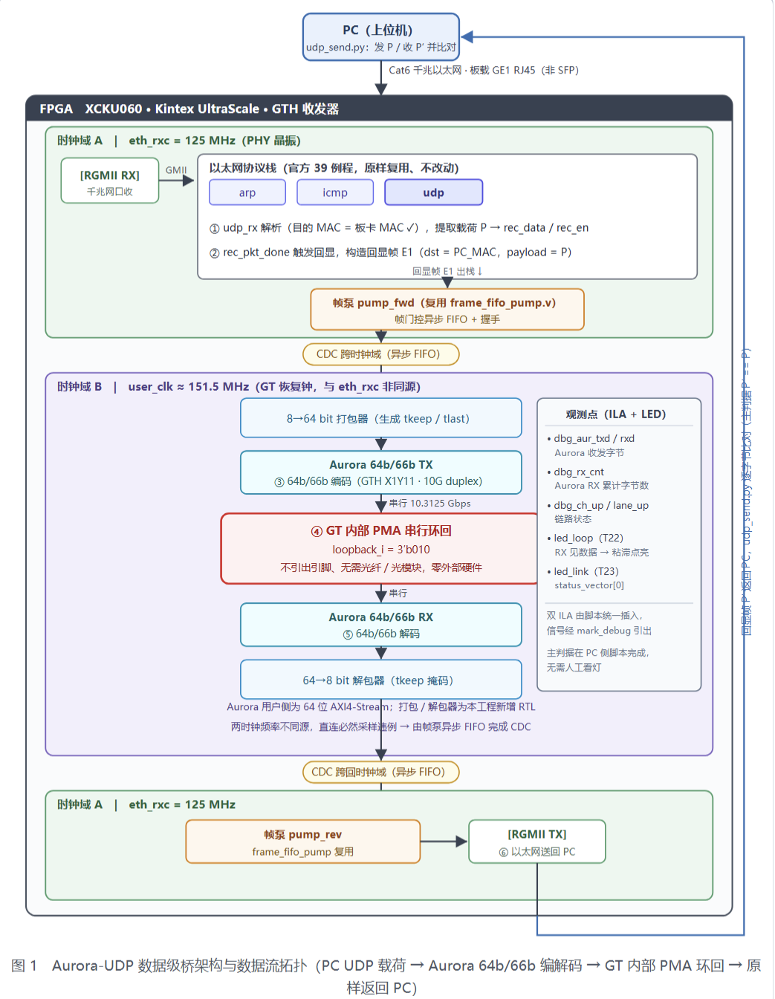
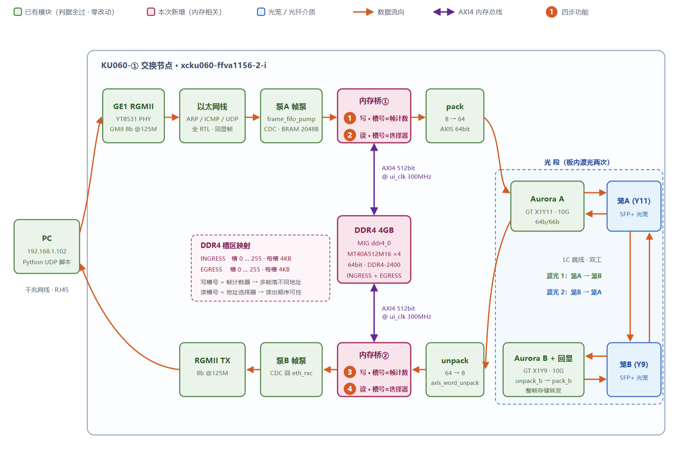
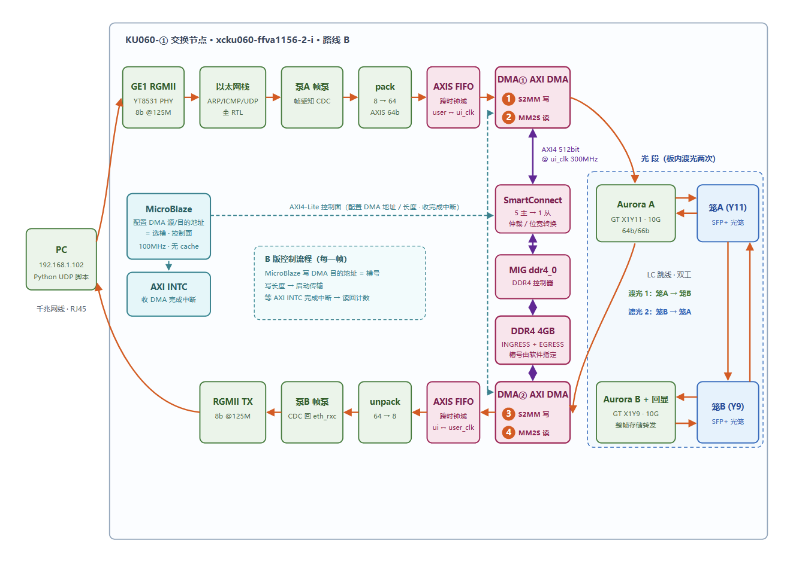

# FPGA_Project — FPGA 高速互联网络平台


基于正点原子 KU060 开发板（Kintex UltraScale `xcku060-ffva1156-2-i`）搭建的多节点数据交换平台：

- **端点接入**：PC / 树莓派等标准以太网设备，经板载千兆 RJ45 网口接入
- **板间干线**：Aurora 64b/66b 协议跑 10G 光纤（SFP+ 光口），多板互联时作为高速骨干
- **板内转发**：数据可直通转发，也可整帧写入 DDR4 缓存后按需读出（大容量排队，拥塞调度的基础）

目标场景是边缘侧多节点协作推理：多块板子组成交换网络，承载节点间的大块数据（如模型分片、会话记录）传输。

> 面向协作者：工程规范（事实源优先级、CDC/ILA/XDC 约定、调试方法论、坑账本）见 [`AGENTS.md`](AGENTS.md)。本 README 是入门第一份文档。

**目录**：[系统定位](#系统定位) · [硬件平台](#硬件平台) · [工程血缘](#工程血缘) · [工程一览](#工程一览) · [内存进环路](#内存进环路) · [快速开始](#快速开始) · [仓库结构](#仓库结构) · [开发约定](#开发约定)

## 系统定位

本平台在实验室 AI Infra 系统中位于**互联层**——向上承接中心算力的推理流量，向下连接边缘执行端，负责节点之间的数据搬运：



图中「**互联层 · FPGA 交换核心**」即本仓库。当前已达成的部分是**单板交换中心**（物理/链路/网络层：10G 过纤、误码 0E0、UDP 回环四包链）；**多端点**接入与**优先级队列 / 反压 / 纳秒时间戳**是后续目标。

## 硬件平台

| 项 | 事实 |
|---|---|
| FPGA | Kintex UltraScale `xcku060-ffva1156-2-i` |
| 系统时钟 | 100 MHz 差分（AK17/AK16）；复位按键 AC34（低有效） |
| 网口 | 双千兆 RGMII（YT8531 PHY），默认 GE1：PC `192.168.1.102` ↔ 板 `192.168.1.10` |
| 光口 | FMC 四 SFP+ 笼（GT Quad X1Y2：A=X1Y11、B=X1Y9、C=X1Y10、D=X1Y8），参考钟 156.25 MHz |
| 调试 | Digilent USB-JTAG 烧录；FT2232H 串口（COM7 @9600） |
| 环境 | Vivado 2023.1；Python 3.10+（Windows 控制台需设 `PYTHONUTF8=1`） |

## 工程血缘

每个新工程只复用**已上板验证通过**的前序部件，官方例程永远是最高事实基准。箭头表示文件与验证资产的继承关系：

```
正点原子 KU060 官方例程库（本仓库全部工程的事实基准）
│
├─[例程39章 以太网UDP]──► project_6   千兆以太网 UDP 协议栈
│        │               ARP / ICMP / UDP 收发回显，ping 0% 丢包
│        │               ✅ 上板验证 2026-09-04
│        │               （含 rgmii_rx_fix2：千兆 RGMII 接收采样时序修复）
│        ▼
│    project_7   SFP 光口承载以太网（内环验证）
│        │       ⏸ 已封存 —— 端点接入统一改用 RJ45 网口后，此路线不再需要
│        │
│        │       帧缓冲泵 frame_fifo_pump 在本工程诞生：
│        │       整帧缓存 + 跨时钟域搬运，此后成为所有数据通路的标配部件
│        ▼
├─[Aurora 64b/66b 例程]─┬► aurora_64b66b_loop_ex   官方例程留档 ⏸
│  （时钟/复位/QPLL      └► project_3   Aurora 64b/66b 链路层（GT 内环）
│   支撑逻辑随工程走）         channel_up / 零误码 ✅ 2026-08-31
│                                   │
│                                   ▼
│                             project_8   Aurora-UDP 桥接
│                             以太网帧穿过 Aurora 64b/66b 编解码后原样返回，
│                             payload 逐字节一致 ✅ 2026-09-18
│                             （= 例程39章协议栈 + Aurora例程支撑逻辑
│                                + project_7 的帧缓冲泵，三者首次合体）
│                                   │
│                                   ▼
│                             project_9   真实光纤链路验证
│                             两个 SFP+ 光口 A↔B 用光纤对接，数据渡光纤往返，
│                             10MB 文件 100% 到达 + SHA256 完全一致 ✅ 2026-09-21
│                                   │
│                                   └─fork──► project_10   DDR4 帧队列（开发中）
│                                                 "内存进环路"：以太网帧写入 DDR4
│                                                 再按帧读出，为大容量排队打地基；
│                                                 复用 project_9 全套数据通路
│                                                 🔄 逻辑与时序预检已收敛，待上板联调
│                                                 ▲
├─[MIG 例程]──► project_4   MIG DDR4 读写校准 ────┘
│               🔄 校准复验待上板；向 project_10 提供 DDR4 控制器
│
└─[MicroBlaze 例程]──► project_1   MicroBlaze 软核最小系统 ✅ 2026-08-11
                       跑通 FPGA 内软核 + Vitis 软件开发流；
                       将来作为控制面（状态上报 / 队列配置）回归 project_10
```

**图例**：✅ 已上板验证闭环 · ⏸ 封存（保留入库，不再推进）· 🔄 进行中

图外挂起支线：project_2（8b/10b 编解码练手，仅起步即跳过——物理层信号质量已由 IBERT 眼图实验覆盖，2026-08-27）；串口调试桥（在 `prj/aurora_64b66b_loop_ex/` 例程目录内，上位机验证资料未收到）。

### 数据环路长什么样（project_8 为例）

血缘图是"谁继承了谁"，这张图标的是"**数据怎么走**"——上面 project_8 那一格的内部结构（图中 GT 为芯片内部串行环回；project_9 把它替换成**真实光纤 A↔B**，其余通路原样保留）：



要点：数据在 **两个时钟域**之间往返（网口侧 125 MHz / 光口侧 151.5 MHz），靠**帧缓冲泵 + 异步 FIFO** 完成跨时钟域搬运；协议栈与 Aurora 均为官方例程原样复用，**本工程新增的只有打包/解包与双帧泵**。

## 工程一览

| 目录 | 内容 | 验证判据（怎么算"过"） | 状态 |
|---|---|---|---|
| `prj/project_1/` | MicroBlaze 软核最小系统 | 串口打印 Hello World | ✅ 2026-08-11 |
| `prj/project_3/` | Aurora 64b/66b IP 配置定版 | GT 内环 channel_up、零误码 | ✅ 2026-08-31 |
| `prj/project_4/` | MIG DDR4 读写校准 | 校准完成 + 读写数据比对零误码；位流已产出 | 🔄 校准复验待上板 |
| `prj/project_6/` | 千兆以太网 UDP 协议栈 | ping 0% 丢包、UDP 回显逐字节一致、Wireshark 抓包核对 | ✅ 2026-09-04 |
| `prj/project_8/` | Aurora-UDP 桥接 | PC 发 UDP → 穿 Aurora 编解码往返 → payload 逐字节一致 | ✅ 2026-09-18 |
| `prj/project_9/` | 真实光纤链路全链路 | 光口 A↔B 对接，10MB 文件 100% 到达 + SHA256 一致 | ✅ 2026-09-21 |
| `prj/project_10/` | DDR4 帧队列（内存进环路） | 仿真六用例全过；真 MIG 综合时序收敛；上板联调待做 | 🔄 开发中 |
| `prj/project_2/` | 8b/10b 编解码练手（仅起步即跳过，物理层由 IBERT 实验覆盖） | — | ⏸ 封存 |
| `prj/project_7/` | SFP 光口以太网前端 | — | ⏸ 封存 |
| `prj/aurora_64b66b_loop_ex/` | Aurora 官方例程 + 串口调试桥 | 例程内环已验证；串口桥验证未完成 | ⏸ 留档 |
| `prj/ibert_ultrascale_gth_0/` | IBERT 物理层实验 | 10G PRBS 过纤零误码 + 眼图 | ✅ 2026-08-27 |
| `prj/0DMA_uart2ddr/` | MicroBlaze+MIG+DMA+UART 参考设计（Vivado 2019.2） | **未验证**，仅作参考骨架 | 🗄️ 归档 |

**状态图例**：✅ 已上板验证闭环 · 🔄 进行中 · ⏸ 封存（保留入库，不再推进）· 🗄️ 归档（仅作参考）

> 📄 上表各工程"**大致怎么做的**"（为什么做这一步、分几步实现、判据细节、期间踩过的坑）另见补充说明：**[docs/导览_cross_已完成工作说明_2026-10-01.md](docs/导览_cross_已完成工作说明_2026-10-01.md)**。
> 分工是：**本 README 讲"是什么、在哪、怎么跑"**，补充说明讲"**当时是怎么做出来的**"。

## 内存进环路

把 DDR4 读写纳入数据环路：以太网帧先写入板载内存，再按帧号读出——为大容量排队与拥塞调度打地基。整件事的**分岔口只有一处：数据怎么进出 DDR**，据此分两步走（导师 2026-09-30 定案）。

### 路线 A · 自写硬件模块直连内存（本期交付）



图中**绿色 = 已有模块（判据全过、零改动）**，**粉色 = 本次新增**。四个内存动作按入向/出向各一组：① 写·槽号＝帧计数 ② 读·槽号＝选择器（出向为 ③④）。上方 AXI4 512 bit @ 300 MHz 连到 MIG 控制器与 DDR4 4 GB；右侧为**板内渡光两次**（笼 A → 笼 B → 回显 → 笼 A）。

**当前状态**：仿真六用例全过；**未建工程、未上板**。

### 路线 B · 软核 + DMA 控制（后继，不推翻 A）



与路线 A 的差别只在**数据面换一层、控制面加一个**：MicroBlaze 经 AXI4-Lite 只下发参数（DMA 源/目的地址＝槽号、长度）、读回状态，**不进入数据通路**；搬运交给 AXI DMA，路由交给 SmartConnect。启动条件是**路线 A 的功能判据全部通过**，两条路线的接口按"可替换"预留，**第二步不返工**。

## 快速开始

以 project_9 为例复现三层验证。所需就三样：**一块 KU060 板 + 一根网线 + 一根 SFP 光纤**（把光口 A、B 对接）。三层判据依次证明"链路在 → 通路通 → 数据对"：

```powershell
# 1) 烧录位流（断电后位流易失，需重烧；脚本幂等）
& 'D:\Xilinx\Vivado\2023.1\bin\vivado.bat' -mode batch -source D:\FPGA\prj\project_9\scripts\program_board.tcl

# 2) 链路层：板上 T23 LED 常亮 = Aurora 双通道链路建立（channel_up 硬门控）

# 3) 网络层：ping 板卡
ping 192.168.1.10 -n 20          # 判据：0% 丢包、全部 <1ms

# 4) 数据层：UDP 回显校验（先关掉占用 1234 端口的程序）
$env:PYTHONUTF8 = 1              # Windows 控制台必设，否则中文输出崩
cd D:\FPGA\prj\project_9
python scripts\udp_verify.py     # 判据：回显一致 12/12
```

大文件完整性验证（数据真实穿过光纤往返）：`python scripts\json_storm.py <任意文件> --out recv.bin`，比对重组文件与源文件 SHA256。

各工程 `scripts\` 下均有 `create_project / build / program` 幂等脚本，可在纯 ASCII 路径下一键重建工程。

## 配套工具：vivado-mcp

[`vivado-mcp/`](vivado-mcp/) 把 Vivado 的常用操作封装成 **32 个工具**（读工程 / 查时序 / 审约束 / 看波形 / 跑综合实现 / 抓 ILA），供 AI 客户端直接调用，不必在 GUI 里逐步点。随仓库提供源码副本，**不含任何本机专有配置**，可在任意机器复现。

> **来源**：上游项目 **[mapleleavessssssss-wq/vivado-mcp](https://github.com/mapleleavessssssss-wq/vivado-mcp)** v0.3.26（Apache-2.0）。
> 与上游**逐字节比对：52 个文件完全相同、0 个修改**，仅做目录重组（上游 `src/vivado_mcp/` + 顶层 `scripts/` `skills/` → 本目录平铺入包内）。
> 上游以 **Vivado 2019** 为基准，本项目运行于 **Vivado 2023.1**——离线工具实测可用；已知差异见 [工具说明](vivado-mcp/README.md)。

```powershell
$env:PYTHONPATH = "D:\FPGA\vivado-mcp"
python -m vivado_mcp doctor     # 只读诊断：能否找到 Vivado、依赖是否齐全
python -m vivado_mcp install    # 可选：注入 Vivado_init.tcl，让 GUI 启动的 Vivado 也能被接管（自动备份）
python -m vivado_mcp            # 启动 MCP server（stdio）
```

其中 `parse_xpr` / `parse_bit_header` / `parse_ltx` / `xdc_lint` 属**离线工具**，不启动 Vivado 即可用。
安装与工具清单详见 [`vivado-mcp/README.md`](vivado-mcp/README.md)。

> ⚠️ **两条硬约束**：① 工具**安装路径必须纯 ASCII**（中文路径经 Vivado Tcl 的 ANSI 解码会乱码，会话必失败）；
> ② Vivado 会话与综合/实现/仿真**全局串行**，同一时刻只让一个客户端占用。**烧板永远归人**。

## 仓库结构

```
prj/                    全部工程集中于此（2026-10-01 归类；本地路径同为 D:\FPGA\prj\）
  ├─ project_N/              各 Vivado 工程（rtl / sim / scripts / xdc / docs）
  ├─ ibert_ultrascale_gth_0/ IBERT 眼图实验工程
  ├─ aurora_64b66b_loop_ex/  Aurora 官方例程留档（内含串口调试桥）
  └─ 0DMA_uart2ddr/          MicroBlaze+DDR4+DMA 参考设计（未验证，仅作骨架）
docs/                   文档中心：实操单、实施单、测试报告、调试记录（脱敏快照）
docs/images/            本 README 引用的拓扑图
vivado-mcp/             配套工具：让 AI 直接操作 Vivado 的 MCP 服务（见下节）
AGENTS.md               工程规范：事实源优先级、硬件事实卡、CDC/ILA/XDC 约定、坑账本
KU_IO.xdc               官方板卡引脚约束（事实基准）
scripts/                顶层 Tcl 骨架（建工程 / 构建 / 烧录）
```

## 开发约定

1. **官方例程 > 已上板验证的工程 > 板卡手册 > AI 生成内容**——冲突时按此优先级裁决。
2. **官方文件不改动原件**：修复一律走"同名模块顶替"或"派生新文件"。
3. **结论必须有判据**：每个"通过"都要落到可复现的证据（计数器对账 / 哈希比对 / 抓包），不接受"看起来能跑"。
4. Vivado 相关路径全 ASCII（中文路径有 GBK 编码实坑）。
5. 文档命名：`[阶段]_prj标识_概要_YYYY-MM-DD.md`（例：`阶段二之八_prj8_数据级桥上板验证单_2026-09-10.md`），详见 [`docs/README.md`](docs/README.md)。

---

*各工程详细验证过程与排障记录见 [`docs/`](docs/)；已完成工作的实现路径见 [补充说明](docs/导览_cross_已完成工作说明_2026-10-01.md)；工程状态以本文件与 git log 为准。*

---

**版权**：本仓库自有内容 Copyright © 2026，**保留所有权利**（All rights reserved）——为毕业论文课题资料，未授予开源许可，如需引用或复用请联系作者。
**例外**：[`vivado-mcp/`](vivado-mcp/) 为第三方开源项目的源码副本，遵循其上游 **Apache License 2.0**（全文见 [`vivado-mcp/LICENSE`](vivado-mcp/LICENSE)），不受上述声明约束。
